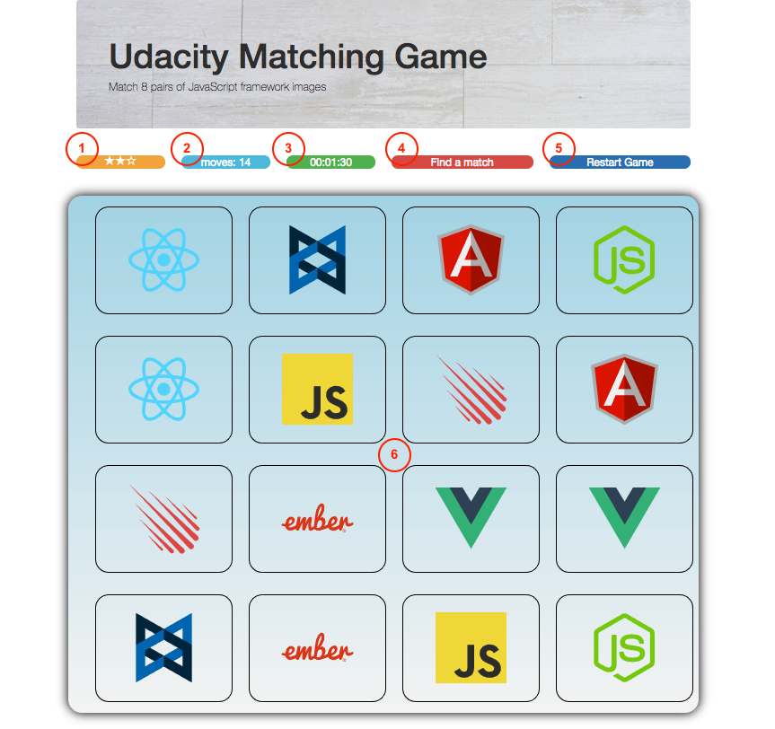
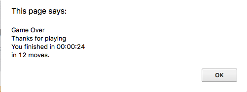

Welcome to JavaScript Matching Game!
===================

Play live game: [click here](<https://swaption2009.github.io/javascript-memory-game/index.html>)

----------

How It Works
-------------

If you're unfamiliar with the game, the rules are very simple: flip over two hidden cards at a time to locate the ones that match!

The game board consists of sixteen cards arranged randomly in a grid. The deck is made up of eight different pairs of cards, each with different symbols on one side.

Each turn:
- A player flips one card over to reveal its underlying symbol
- The player then turns over a second card, trying to find the corresponding card with the same symbol
- If the cards match, both cards stay flipped over
- If the cards do not match, both cards are returned to their initial hidden state
- The game ends once all cards have been correctly matched.

----------

Game Board
-------------

1. Star rating
    - 3-star: solve game in 10 moves or less
    - 2-star: solve game in 11 - 15 moves
    - 1-star: solve game in  16 - 20 moves
    - no star: solve game in more than 20 moves
2. Total moves:
    - shows number of moves made by a player
    - 1 move is counted when a pair of either matching or not matching cards is opened
3. Elapsed time
4. Game message
    - "Matched found": when a pair of cards matches perfectly
    - "Not found": when the second card does not match with the first card
5. Restart button
    - reshuffle cards
    - reset time

_Pop-up window when the player completes the game:_

----------

Codes
-------------

**Files**
1. index.html (placeholder)
2. style.css (game stylesheets)
3. scripts.js (game logics)
4. /img (image folder)

**Dependencies**
1. HTML 5
2. Responsive design with Boostrap 3